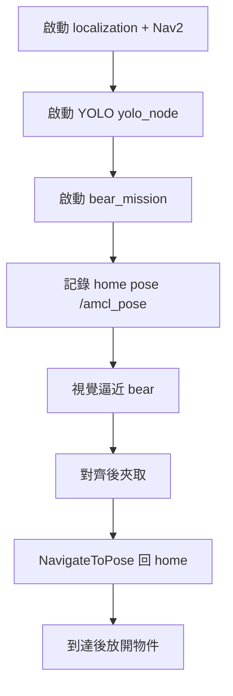

# 夾熊任務（Bear Mission）操作手冊

本文件說明如何在 **RNE-wildbot** 專案中啟動「夾熊任務」：由 YOLO 偵測熊的位置，車輛以視覺伺服接近、機械臂夾取，最後透過 Nav2 回到任務起點。

相關程式碼：

| 套件 | 主要檔案 |
|------|----------|
| `pros_car_py` | `bear_mission_node.py`、`obstacle_guard.py`、`launch/bear_task1.launch.py` |
| `yolo_example_pkg` | `object_detect.py`（發布 `/yolo/target_info`、`/yolo/target_marker`） |

---

## 任務流程概覽



1. **記錄起點**：從 `amcl_pose_topic`（預設 `/amcl_pose`）讀取目前位姿作為 home。
2. **視覺逼近**：訂閱 `/yolo/target_info`（深度、像素偏移），控制底盤前進／轉向；可啟用 LiDAR + 深度避障。
3. **夾取**：深度夠近或目標離開畫面後，停止底盤並驅動機械臂。
4. **回程**：透過 Nav2 `NavigateToPose` 回到 home；若 Nav2 卡住可啟用 fallback 手動微調。
5. **放開**：到 home 附近後放開夾爪（`drop_at_home:=true` 時）。

預設 **`auto_start:=true`**：節點啟動約 5 秒後自動跑完整流程。若要手動觸發，見下方「手動啟動」。

---

## 重要前提

### 必須同時滿足

| 項目 | 說明 |
|------|------|
| **Nav2** | `navigate_to_pose` action 可用（localization stack 已啟動） |
| **定位話題** | 預設 `/amcl_pose`（`PoseWithCovarianceStamped`）持續有資料 |
| **YOLO** | `yolo_node` 已跑，且 `target_class:=bear`（或模型輸出類別名為 `bear`） |
| **相機 + 深度** | YOLO 訂閱 `/camera/image/compressed` 與深度圖 |
| **LiDAR**（建議） | `/scan` 有資料，避障與 Nav2 護欄才有效 |
| **ROS_DOMAIN_ID** | **所有容器必須相同**（`pros_car/.env`、`ros2_yolo_integration/.env`、`pros_app`、Wildbot 的 `.env`） |
| **Docker bridge** | 所有需互通的容器須在**同一個** Docker network（見下方） |

### 請勿同時執行

- **`robot_control`** 與 **`bear_mission`** 會同時對底盤發輪速指令，造成衝突。執行夾熊任務前請關閉 `robot_control`。

---

## 系統架構與 Topic

```
┌─────────────────────┐     /camera/*      ┌──────────────────────┐
│ 相機 / LiDAR / 車體  │ ─────────────────► │ yolo_example_pkg     │
│ (Wildbot 或 Unity)   │                    │ yolo_node            │
└─────────────────────┘                    └──────────┬───────────┘
                                                      │ /yolo/target_info
                                                      │ /yolo/target_marker
┌─────────────────────┐     /amcl_pose              ▼
│ pros_app            │ ─────────────────► ┌──────────────────────┐
│ localization+Nav2   │     /scan          │ pros_car_py          │
└─────────────────────┘ ─────────────────► │ bear_mission         │
                                           └──────────┬───────────┘
                                                      │ 輪速 / 機械臂
                                                      ▼
                                           ┌──────────────────────┐
                                           │ 實車或 Unity 模擬     │
                                           └──────────────────────┘
```

### bear_mission 主要訂閱

| Topic | 型別 | 用途 |
|-------|------|------|
| `/amcl_pose`（可改參數） | `PoseWithCovarianceStamped` | 記錄 home、回程判斷 |
| `/yolo/target_info` | `Float32MultiArray` | 深度、水平像素誤差等 |
| `/yolo/target_marker` | `Marker` | 目標在相機座標的可視化／輔助 |
| `/scan` | `LaserScan` | 接近與 Nav2 避障 |
| `/obstacle/sector_min_depth` | `Float32MultiArray` | YOLO 節點發布的前方扇區最小深度 |

### bear_mission 主要發布／控制

- 底盤：透過 `RosCommunicator` 發布前後輪速（與 `robot_control` 相同介面）
- 機械臂：`ArmController` 關節軌跡
- Nav2：`NavigateToPose` action client

### YOLO 節點需求

| Topic | 方向 | 說明 |
|-------|------|------|
| `/camera/image/compressed` | 訂閱 | RGB 影像 |
| `/camera/depth/image_raw` 或 `/camera/depth/compressed` | 訂閱 | 深度（至少一個有資料） |
| `/camera/image/camera_info` | 訂閱 | 相機內參 |
| `/yolo/target_info` | 發布 | bear 目標資訊 |
| `/yolo/target_marker` | 發布 | RViz 標記 |
| `/obstacle/sector_min_depth` | 發布 | 避障用扇區深度 |

---

## 啟動方式（三種情境）

### 情境 A：Unity 模擬（pros_app localization）

適合在實驗室用 Unity + pros_app 測試，**不需 Wildbot 硬體**。

**1. 啟動 localization / Nav2**（在 `workspace/pros/pros_app` 依專案 README 啟動 compose）

**2. 啟動 YOLO 容器**

```bash
cd workspace/pros/ros2_yolo_integration
# 確認 .env 的 ROS_DOMAIN_ID 與 pros_app 一致
./yolo_activate.sh
# 容器內
r   # 或：colcon build --symlink-install && source install/setup.bash
ros2 run yolo_example_pkg yolo_node --ros-args \
  -p target_class:=bear \
  -p weights_path:=/workspaces/src/yolo_example_pkg/models/<你的權重>.pt
```

**3. 啟動 bear_mission 容器**

```bash
cd workspace/pros/pros_car
export ROS_BRIDGE_NETWORK=compose_my_bridge_network   # 見下方「網路名稱」
export ROS_DOMAIN_ID=1   # 與 pros_app、yolo 的 .env 一致
./car_control.sh
# 容器內
r
ros2 launch pros_car_py bear_task1.launch.py obstacle_guard_enabled:=false

# launch 預設 use_unity_camera_nav:=true，適合 Unity
```

---

### 情境 B：Wildbot 實車（RNE-wildbot）

需先讓車體、相機、LiDAR 正常運作，再跑 YOLO 與 bear_mission。

**1. 啟動 Wildbot 周邊（馬達、相機、LiDAR）**

```bash
cd RNE-wildbot/wildbot_workspace
# 編輯 docker/compose/.env，設定與 pros 相同的 ROS_DOMAIN_ID
./scripts/00_start_all.sh
# 或個別：./scripts/kros_car.sh、./scripts/camera_gemini.sh、./scripts/lidar.sh
```

**2. 啟動 localization + Nav2**

依你們實驗室的 map／定位方式啟動 `pros_app` 或 Wildbot 對應的 Nav2 stack，並確認：

```bash
ros2 topic echo /amcl_pose --once
ros2 action list | grep navigate_to_pose
```

**3. YOLO**（同情境 A，權重需為 bear/knob 訓練模型）

**4. bear_mission**（實車請關閉 Unity 模式）

```bash
export ROS_BRIDGE_NETWORK=compose_my_bridge_network
export ROS_DOMAIN_ID=<與全場一致>
./car_control.sh
# 容器內
ros2 launch pros_car_py bear_task1.launch.py use_unity_camera_nav:=false obstacle_guard_enabled:=false
```

若相機／LiDAR topic 名稱與預設不同，需同步修改 YOLO 訂閱話題或增加 relay 節點。

---

### 情境 C：僅跑節點（已在外部準備好所有 topic）

```bash
ros2 run pros_car_py bear_mission --ros-args \
  -p auto_start:=false \
  -p use_unity_camera_nav:=false
# 準備好後手動觸發
ros2 service call /start_bear_mission std_srvs/srv/Trigger
```

---

## 建置與環境變數

### colcon 建置

在 `pros_car` 或 `ros2_yolo_integration` 容器內：

```bash
cd /workspaces   # 或 car_control.sh 掛載的 src 上層
colcon build --symlink-install
source install/setup.bash
```

`bear_mission` 與 `bear_task1.launch.py` 已註冊於 `pros_car_py/setup.py`。

### ROS_DOMAIN_ID

各目錄的 `.env` 可能不同（例如 `pros_car` 為 `1`、`wildbot_workspace` 為 `0`）。**執行前請統一**，否則節點彼此看不見：

```bash
# 在每個容器內確認
echo $ROS_DOMAIN_ID
ros2 topic list
```

建議：選一個 ID，寫入所有 `.env`，並在 `car_control.sh` 前 `export ROS_DOMAIN_ID=...`。

### Docker 網路名稱（ROS_BRIDGE_NETWORK）

`car_control.sh` 預設：

```bash
ROS_BRIDGE_NETWORK=compose_my_bridge_network
```

這是 **Docker network 名稱**，不是 ROS topic。查詢方式：

```bash
docker network ls | grep bridge
```

常見名稱：

- `compose_my_bridge_network`（Wildbot `launch_shell.sh` 建立）
- `pros_app_my_bridge_network`（在 pros_app 目錄跑 compose 時）

**錯誤範例**：`export ROS_BRIDGE_NETWORK=/amcl_pose` → 容器無法加入網路，收不到定位。

啟動 `car_control.sh` 時可覆寫：

```bash
ROS_BRIDGE_NETWORK=pros_app_my_bridge_network ./car_control.sh
```

### YOLO 模型

將訓練好的 `.pt` 放到：

```
workspace/pros/ros2_yolo_integration/src/yolo_example_pkg/models/
```

建置後會安裝到 share 目錄。執行時可用 `weights_path` 指定絕對路徑。

---

## 常用指令速查

```bash
# 自動任務（預設 5 秒後開始）
ros2 launch pros_car_py bear_task1.launch.py

# 實車
ros2 launch pros_car_py bear_task1.launch.py use_unity_camera_nav:=false

# 延長等待 localization / YOLO 就緒
ros2 launch pros_car_py bear_task1.launch.py auto_start_delay_sec:=15.0

# 手動觸發
ros2 run pros_car_py bear_mission --ros-args -p auto_start:=false
ros2 service call /start_bear_mission std_srvs/srv/Trigger

# 除錯：確認 topic
ros2 topic hz /amcl_pose
ros2 topic hz /yolo/target_info
ros2 topic echo /yolo/target_info --once
ros2 topic hz /scan
```

---

## 參數調整建議

| 參數 | 預設 | 說明 |
|------|------|------|
| `use_unity_camera_nav` | launch 為 `true` | Unity 用較遠避障閾值；**實車請 `false`** |
| `visual_servo_target_depth_m` | `0.55` | 逼近目標距離；太近 YOLO 易丟框可略增 |
| `grasp_trigger_dist_m` | `0.65` | 低於此深度觸發夾取 |
| `align_pixel_thresh` | `40.0` | 夾取前允許的水平像素誤差；越小越要求置中 |
| `approach_timeout_sec` | `120.0` | 逼近階段最長時間 |
| `obstacle_guard_enabled` | `true` | 逼近時 LiDAR+深度避障 |
| `auto_start_delay_sec` | `5.0` | 自動開始前等待（秒） |
| `amcl_pose_topic` | `/amcl_pose` | 若定位發在不同 topic 請改掉 |
| `drop_at_home` | `true` | 回 home 後是否放開夾爪 |

完整參數列表見 `bear_mission_node.py` 的 `declare_parameter`。

---

## 常見問題與排解

### 1. 一直顯示「收不到 /amcl_pose」

**現象**：日誌 `Still waiting for '/amcl_pose'` 或 timeout。

**可能原因與解法**：

| 原因 | 解法 |
|------|------|
| localization 未啟動 | 先啟動 pros_app／Nav2 stack |
| `ROS_DOMAIN_ID` 不一致 | 統一所有 `.env` 並重啟容器 |
| Docker 不在同一 network | 設定正確的 `ROS_BRIDGE_NETWORK` 後重跑 `car_control.sh` |
| topic 名稱不同 | `ros2 topic list \| grep pose`，改用 `-p amcl_pose_topic:=<實際名稱>` |
| 用錯變數當 network | 勿把 `/amcl_pose` 設成 `ROS_BRIDGE_NETWORK` |

驗證：

```bash
# 在 bear_mission 容器內
ros2 topic echo /amcl_pose --once
```

---

### 2. 收不到 `/yolo/target_info`（車不動、只原地轉）

**現象**：逼近階段一直搜尋旋轉，或 log 無 target 深度。

**可能原因與解法**：

| 原因 | 解法 |
|------|------|
| `yolo_node` 未啟動 | 先啟動 YOLO 並確認 `ros2 topic hz /yolo/target_info` |
| `target_class` 不符 | 確認 `--ros-args -p target_class:=bear` 與模型類別名一致 |
| 權重錯誤或路徑不對 | 檢查 `weights_path`、models 目錄是否 colcon 安裝 |
| 相機 topic 無資料 | `ros2 topic hz /camera/image/compressed` |
| 深度圖無資料 | 檢查 `/camera/depth/image_raw` 或 `/camera/depth/compressed` |
| `ROS_DOMAIN_ID` 不同 | 與 YOLO 容器統一 |
| 畫面中沒有 bear | 確認偵測可視化 topic `/yolo/detection/compressed` |

---

### 3. `ros2 topic list` 是空的或很少

**原因**：`ROS_DOMAIN_ID` 錯誤，或不在 ROS 網路環境。

**解法**：

```bash
export ROS_DOMAIN_ID=<與其他容器相同>
source /opt/ros/jazzy/setup.bash   # 依實際發行版
source install/setup.bash
```

---

### 4. 與 `robot_control` 衝突（車子異常抖動／指令打架）

**解法**：只保留 `bear_mission`，關閉 `ros2 run pros_car_py robot_control`。

---

### 5. Nav2 回程失敗（ABORTED / 卡住）

**現象**：log 顯示 `NavigateToPose` ABORTED 或長時間無進度。

**可能原因與解法**：

| 原因 | 解法 |
|------|------|
| costmap 障礙 | 確認 `/scan` 正常；必要時清除 costmap（節點內建重試） |
| 起點記錄時定位飄移 | 任務開始前等 AMCL 穩定再觸發 |
| Nav2 未就緒 | 確認 `navigate_to_pose` action 存在 |
| 啟用 fallback | 預設 `fallback_home_enabled:=true`，會改用手動微調回 home |

可調：`nav_home_timeout_sec`、`nav_stuck_time_sec`、`home_reached_dist_thresh_m`。

---

### 6. 逼近時一直後退或不敢前進（避障過敏）

**現象**：obstacle_guard 頻繁 STOP。

**解法**：

- 實車確認 `use_unity_camera_nav:=false`（Unity 閾值較遠，實車可能誤判）
- 檢查 `/scan` 是否雜訊、雷射打到機械臂
- 調大 `obstacle_stop_m` / `obstacle_slow_m`（預設 `-1` 為自動；可設具體公尺值）
- 確認 YOLO 有發 `/obstacle/sector_min_depth`

---

### 7. 夾取太早／太晚

| 現象 | 調整 |
|------|------|
| 太早夾（還很遠） | 降低 `grasp_trigger_dist_m` 或調高 `grasp_depth_max_m` 邏輯相關參數 |
| 太晚／撞前才停 | 調低 `visual_servo_target_depth_m`、`approach_stop_dist_m` |
| 熊消失才夾 | 調整 `grasp_trigger_lost_frames`（預設 3 幀） |

---

### 8. 機械臂擋住相機（Unity）

**解法**：launch 預設 `unity_stow_elbow_enabled` 會在任務前將 Elbow 收到約 180°；可調 `unity_stow_elbow_deg`。

---

### 9. `colcon build` 找不到 `bear_mission` 或 launch

**解法**：

```bash
# 確認檔案存在
ls src/pros_car_py/pros_car_py/bear_mission_node.py
ls src/pros_car_py/launch/bear_task1.launch.py
# 重新建置
colcon build --packages-select pros_car_py --symlink-install
source install/setup.bash
ros2 pkg executables pros_car_py | grep bear
```

---

### 10. Wildbot 相機 topic 與 YOLO 預設不符

YOLO 預設訂閱 `/camera/image/compressed` 等。若 Wildbot 發布不同名稱，可：

- 用 `topic_tools relay` 轉發到預設名稱，或
- 修改 `object_detect.py` 訂閱話題（需重新 colcon build）

---

### 11. macOS 開發機 GPU / Docker 問題

`car_control.sh` 在 macOS 會停用 GPU；YOLO 可能較慢但可跑。若容器無法啟動，檢查 Docker Desktop 網路模式與 volume 掛載路徑。

---

## 建議除錯順序

任務無法啟動時，依序檢查（每步都在 **bear_mission 容器內**執行）：

1. `echo $ROS_DOMAIN_ID` 與其他容器一致  
2. `ros2 topic echo /amcl_pose --once` 有輸出  
3. `ros2 topic hz /yolo/target_info` 約 5–15 Hz（視 YOLO 負載）  
4. `ros2 topic hz /scan` 正常  
5. `ros2 action list | grep navigate` 有 `navigate_to_pose`  
6. 確認未同時執行 `robot_control`  
7. 查看 `bear_mission` terminal 日誌（階段：record home → approach → grasp → nav home）

---

## 相關文件

- 一般車控與 `robot_control`：`README.md`
- YOLO 套件與模型放置：`../ros2_yolo_integration/README.md`
- Wildbot 硬體啟動：`../../../wildbot_workspace/README.md`
- localization：`../pros_app/README.md`
